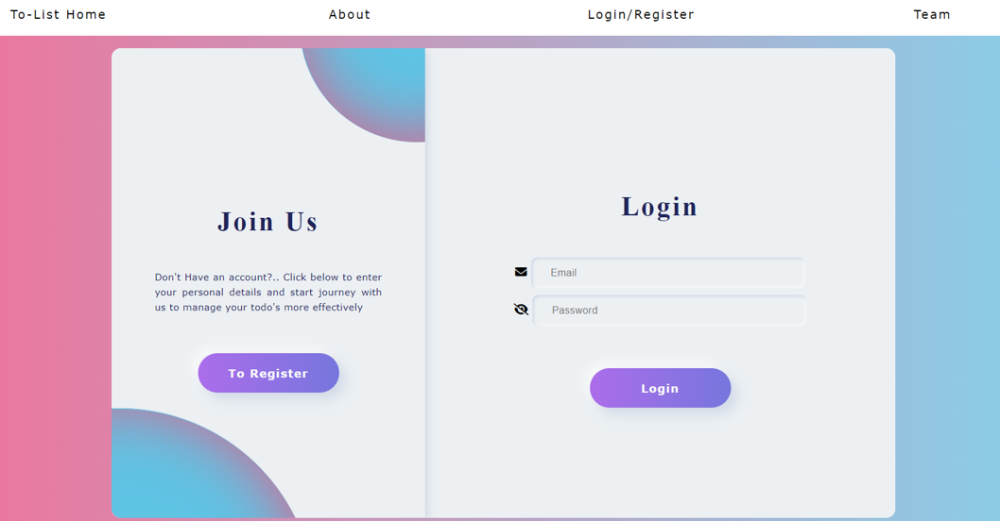
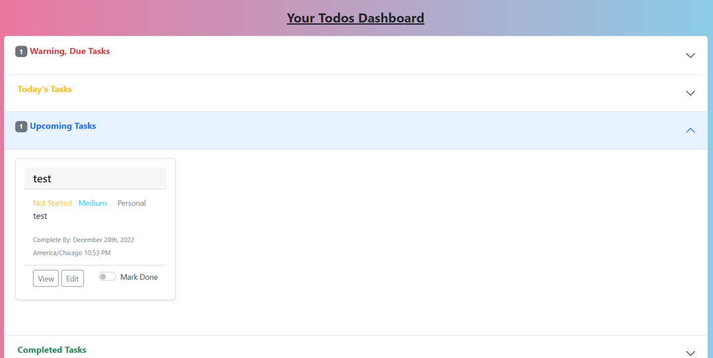
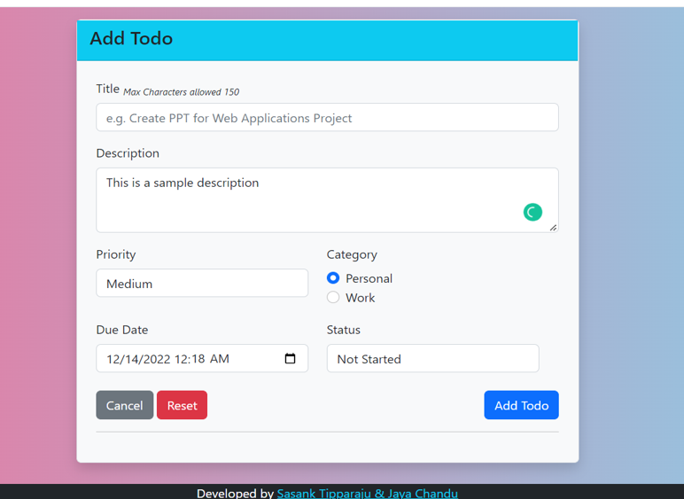

<H1 align ="center" > PHP Based Todo-List Application  </h1>
<h5  align ="center"> All us to organize and track tasks in our day to day life </h5>

### To test it in live - Please Click Here[https://sasank-todo-list.herokuapp.com/]

##  Key Features

- User Registration and Login
- All To-do’s dashboard
- To-do’s / tasks Prioritization 
- To-do’s/tasks are Organized with due_date in dashboard
- CRUD operations (Task create, read, update and delete)
- Can mark complete once done
- Can categorize into personal or work related
 

## Configuration and Setup

Technologies Utilized:
• Frontend: PHP, CSS, JavaScript, Jquery, axios, Bootstrap
• Backend: PHP
• Database: MySQL
• Database: Mamp

### import or use sql queries from To-Do list/database/sql.sql file to create database and respective tables
To Change Database Connection URL : To-Do List -> includes -> pdo.php
please make sure structure of the folder to be placed in MAMP/htdocs folder (Unzip the file and place it same in htdocs)

#Please make sure all the folders and files are in the directory
Database user should be created with the credentials and should be granted with all the priviliged access to the database or replace credentials of your in pdo.php filr
username : 
password :

_To-Do List
|
├── _controller
│   ├── add_todo.php
│   ├── all_todos.php
│   ├── check_user.php
│   ├── crud_todos.php
│   ├── delete_todo.php
│   ├── edit_todo.php
│   ├── login.php
│   ├── logout.php
│   ├── register.php
│   └── view_todo.php
├── _css
│   └── index.css
├── _database
│   └── sql.sql
├── _images
│   └── todo.jpg
├── includes
│   ├── pdo.php
│   └── utility.php
├── js
│   └── todo_list.js
├── index.php
└── README.txt
